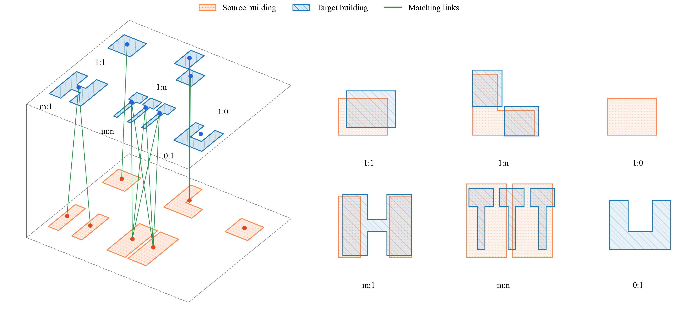
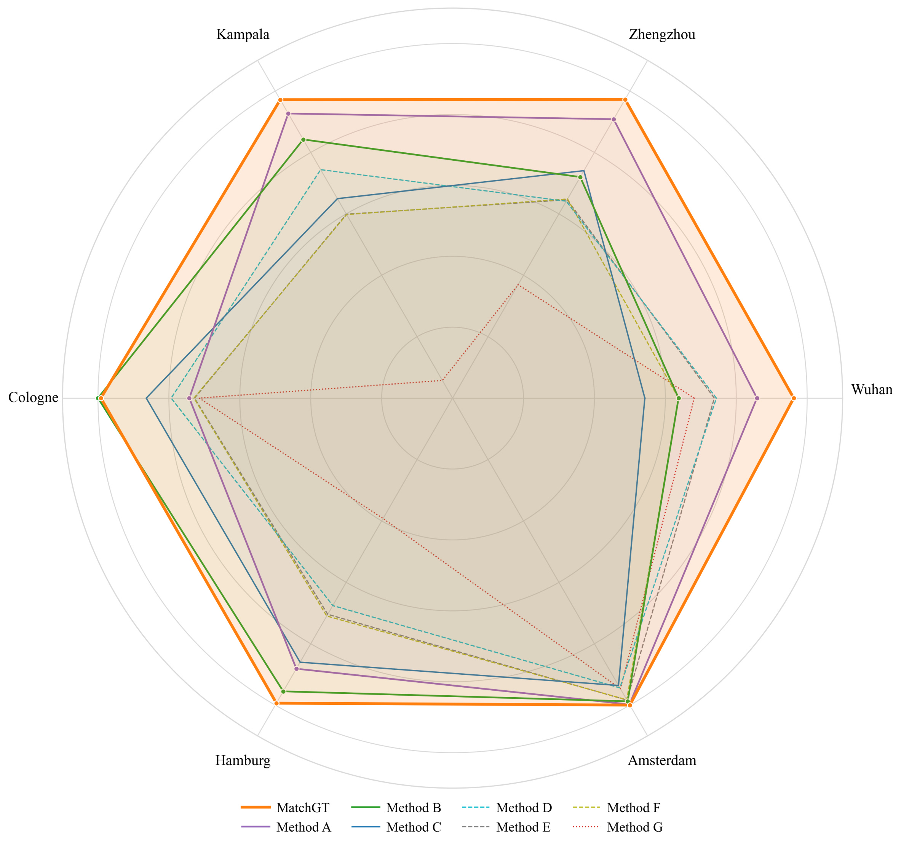

<h1 align="center">🏢 MatchGT</h1>

<p align="center">
  <strong>A Unified Framework for Multi-Relation Building Footprint Matching</strong>
</p>
<p align="center">
  <a href="#"></a>  <a href="#"></a>  <a href="#"></a>  <a href="#license"></a>  <a href="#"></a>
</p>


<p align="center">
  <a href="#-overview">Overview</a> •
  <a href="#-highlights">Highlights</a> •
  <a href="#-datasets">Datasets</a> •
  <a href="#-code-structure">Code Structure</a> •
  <a href="#-quick-start">Quick Start</a> •
  <a href="#-citation">Citation</a>
</p>

---

## 📢 News

| Date | Update |
|:----:|:-------|
| 🔜 | Full source code will be released upon paper acceptance |
| 2025.12 | Paper submitted |

---

## 📖 Overview

**MatchGT** is a unified deep learning framework for **multi-relation building footprint matching** across heterogeneous geospatial datasets. It addresses the challenging task of identifying corresponding building entities between different data sources, handling complex matching relationships including:

<p align="center">
  
</p>


<table align="center">
  <tr>
    <td align="center"><b>1:1</b><br/>One-to-One</td>
    <td align="center"><b>1:n</b><br/>One-to-Many</td>
    <td align="center"><b>m:1</b><br/>Many-to-One</td>
    <td align="center"><b>m:n</b><br/>Many-to-Many</td>
    <td align="center"><b>0:1</b><br/>New Building</td>
    <td align="center"><b>1:0</b><br/>Demolished</td>
  </tr>
</table>
---

## ✨ Highlights

- 🎯 **Unified Framework** — Handles all six types of matching relationships in a single model
- 🚀 **High Performance** — Achieves F1 scores of **96.21%–99.97%** across diverse datasets
- ⚡ **Efficient** — Inference time ranges from **0.8s to 38s** on real-world datasets
- 🔄 **Generalizable** — Demonstrates strong cross-dataset transfer capability
- 📊 **Data-Efficient** — Maintains **>94%** F1 under few-shot settings

---

## 📊 Datasets

MatchGT is evaluated on **six real-world building datasets** spanning Asia, Europe, and Africa:

| Dataset | Location | Source A | Source B | #Buildings (A/B) | Characteristics |
|:-------:|:--------:|:--------:|:--------:|:----------------:|:----------------|
| **Wuhan** | China | Amap | Baidu Maps | 617 / 474 | Non-linear position offset |
| **Zhengzhou** | China | Amap | OSM | 5,038 / 4,156 | Complex 1:n and m:1 relations |
| **Kampala** | Uganda | OSM | Microsoft | 6,126 / 2,969 | Significant LoD differences |
| **Cologne** | Germany | ALKIS | OSM | 313 / 354 | Dense row houses |
| **Hamburg** | Germany | LGV | OSM | 5,743 / 6,691 | Mixed urban/suburban |
| **Amsterdam** | Netherlands | TOP10NL | TOP10NL | 28,658 / 28,364 | Temporal update scenario |


---

## 📁 Code Structure

```
MatchGT/
├── 📄 README.md                          # This file
├── 📄 requirements.txt                   # Python dependencies
├── 📄 LICENSE                            # MIT License
│
├── 📂 src/
│   ├── 📄 MatchGT.py                     # Main model implementation
│   ├── 📄 split_dataset_kfold.py         # Dataset splitting utilities
│   ├── 📄 predict_and_evaluate.py        # Inference and evaluation
│   └── 📄 evaluate_PreAccF1_Nomal_Vis.py # Metrics computation & visualization
│
├── 📂 data/                              # Dataset directory (not included)
│   ├── 📂 Wuhan/
│   ├── 📂 Zhengzhou/
│   ├── 📂 Kampala/
│   ├── 📂 Cologne/
│   ├── 📂 Hamburg/
│   └── 📂 Amsterdam/
│
├── 📂 checkpoints/                       # Trained model weights
│
├── 📂 outputs/                           # Experiment outputs
│
└── 📂 assets/                            # Images
```

---

## 🚀 Quick Start

### Environment Setup

```bash
# Clone the repository
git clone https://github.com/ParkourX/MatchGT.git
cd MatchGT

# Create conda environment
conda create -n matchgt python=3.8
conda activate matchgt

# Install dependencies
pip install -r requirements.txt
```

### Requirements

| Package | Version |
|:--------|:--------|
| Python | ≥ 3.8 |
| PyTorch | ≥ 1.10 |
| GeoPandas | ≥ 0.10 |
| Shapely | ≥ 1.8 |
| NetworkX | ≥ 2.6 |
| scikit-learn | ≥ 1.0 |
| pandas | ≥ 1.3 |
| numpy | ≥ 1.21 |

### Training

```bash
# Train on a specific dataset with K-fold cross-validation
python src/MatchGT.py --dataset Wuhan --k_folds 5
```

### Inference

```bash
# Run inference with pre-trained checkpoint
python src/predict_and_evaluate.py --checkpoint checkpoints/best_model.pt --data data/test/
```

---

## 📈 Results

### Overall Performance

<p align="center">
  
</p>


MatchGT achieves state-of-the-art performance across all six datasets, with particularly strong results on complex matching scenarios involving m:n relationships.


---

## 📝 Citation

If you find this work useful for your research, please consider citing:

```bibtex
@article{MatchGT2026,
  title     = {MatchGT},
  author    = {[Authors]},
  journal   = {[Journal]},
  year      = {2026},
  note      = {Under Review}
}
```

> 📌 Citation information will be updated upon paper acceptance.

---

## 📜 License

This project is licensed under the MIT License - see the [LICENSE](LICENSE) file for details.

---

## 🙏 Acknowledgements

We thank the data providers for making their datasets publicly available:
- [OpenStreetMap](https://www.openstreetmap.org/)
- [Microsoft GlobalMLBuildingFootprints](https://github.com/microsoft/GlobalMLBuildingFootprints)
- [PDOK - Kadaster Netherlands](https://www.pdok.nl/)
- [ALKIS - Germany](https://www.adv-online.de/)
- [Hamburg LGV](https://transparenz.hamburg.de/)

---

<p align="center">
  <sub>⭐ If you find this project helpful, please consider giving it a star!</sub>
</p>
